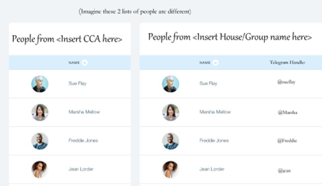

# Kakilang Social Website for Orbital

**Proposal for Orbital 2022**

**Team Name:** 

Ropasalis

**Proposed Level of Achievement:**

Project Gemini

**Motivation**

Due to the advent of **Covid**, **community life** (Under the context of
halls and residential colleges) within NUS has taken an **adverse turn**
as meeting new people have become harder. Even though there are
platforms that allow one to meet new people within the community (e.g.
interest groups/ CCAs), there is **no platform** that has the **sole
purpose of allowing you to meet new people within your own community**.

Other groups usually have an **unspoken requirement that acts as a
barrier** that prevents people from meeting others.

For example, interest groups/CCAs usually require you to have an
interest in the particular skill in order to join them, House/Faculty
activities are very daunting to go in alone as friends usually go to
these activities together et cetera.

But providing **a platform solely for meeting new people** sets that one
goal as the expectation, **mitigating the previously said social
barriers**.

**Aim **

We hope to be able to make a social platform that allows people within
the same community to connect with one another more easily, allowing
more people to know more people within their own community.

**User Stories**

1.As a Year 1, I wish to meet more people/freshies in my own batch and
in my own hall/residential college as I am new to the community.

2.As a senior, I wish to meet new freshies/juniors who come into my
residential college/hall.

3.As a community head, I wish to be able to facilitate activities to
help bond my own community.

4.As an administrator who wants to prevent abuse of the system, I want
to be able to identify abusers, warn them and ban them if they continue
to cause problems.

**Features and Timeline**

\[Please list down the key features of your system with a rough timeline
for completion.\]

The **Web Landing Page** that provides a list of people for one to
interact with.

It will display a list of people, which comprises of their name and a
mode of communication (e.g. email/telehandle as most people in uni use
telegram as a mode of communication) as shown below.

\<Please note that this is just a very early mockup and might not be
representative of our final
product>. 

An **Account System** that each user can create and manage their own
accounts. The details that they put in also determine which lists of
people are available to them, and who are in those lists. Password
encryption could also possibly be done.

<u>Features to be completed by the end of May:  
</u>1. Landing Page and account system

1.  Allow users to log into their account and out.

2.  Display basic information (their own information only)

2\. Filtering system

1.  Allow users to see other people’s data depending on the information
    that they have provided.

<u>Features to be completed by the End of June: </u>

1\. Messaging system

a\. Allow users to text one another through the application

2\. Integration with Social Media

a\. Allows for users to connect to Social Media platforms with ease.

<u>Features to be completed by the end of July:</u>

2 Integration with Social Media/NUSMODS

a\. Allow each account to grab their public feed (e.g. show the recent
few posts of Instagram/ show their linkedin profile).

b\. Links with NUSMODS to show each person’s timetable, allowing for
ease of setting up group meetings.

3\. “Get to know you” Events.

a\. Allow admin users (e.g. people who are “leaders” of a CCA group etc)
to initiate “Get to know you” Events.

b\. These events groups people together in groups of x, where x is a
number decided by the admin user. This creates a group for each group of
people to chat with one another and get to know each other. There could
be preset tasks (e.g. go for a meal, watch a movie together) that the
admin leader could implement for them to motivate them to go out
together with a prize at the end of the event for each group.

**Tech Stack**

1\. HTML/CSS/Javascript

2\. ReactJS

3\. Express + NodeJS

4\. MongoDB/GraphQR